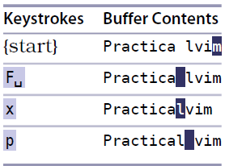

#Tip59: Delete, Yank, and Put with Vim's Unnamed Register  
  
Normally when we discuss cut, copy, and paste, we talk about putting text on a clipboard.  
In Vim's terminology, we don't deal with a clipboard but instead with **register**.  
  
**Transposing Characters**  
##x  
>cuts the character under the cursor, placing a copy of it in the **unnamed register**.  
  
##p  
>pastes the contents of the unnamed register **after** the **cursor position**.  
  
##xp  
>Transpose the next two characters.  
  
  
  
**Transposing Lines**  
##dd  
>cuts the current line, placing it into the unnamed register.  
  
##p  
>pastes the contents of the unnamed register **after** the **current line**.  
  
##ddp  
>Transpose the order of this line and its successor.  
  
  
  
**Duplicating Lines**  
##yyp  
>duplicates current line.  Does a line-wise copy and paste.  
  
  
  
**Oops! I Clobbered My Yank**  
##P  
>paste the contents of our unnamed register **in front of** the **cursor**.  
  
##diw  
>in this case, overwrite the contents of the unnamed register.  
  
  
  
#[Tip58](tip58.md) [Tip60](tip60.md)
