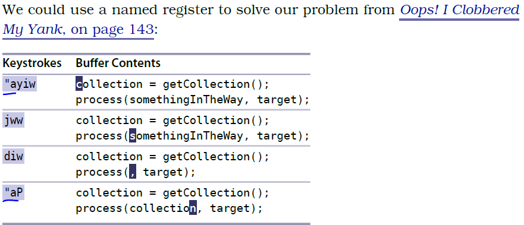
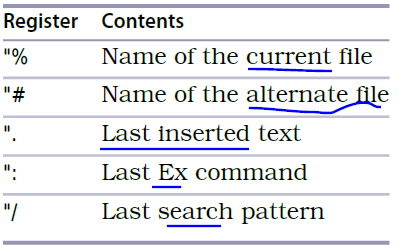

#Tip60: Grok Vim's Registers  
Rather than using a single clipboard for all cut, copy and paste operations, Vim provides **multiple registers**. When we use the delete, yank, and put commands, we can specify which register we want to interact with.  
  
**Addressing a Register**  
##"{register}  
>specify which register we want to use by prefixing the command with `"{register}`. If we don't specify a register, then Vim will use the **unnamed register**.  
  
**Vim's Terminology Versus the World**  
>1. Vim's **put** command is effectively identical to the **paste** operation. Both words begin with the letter **p**.  
>2. Vim's **yank** command is equivalent to the **copy** operation. Historically, the `c` command was already assigned to the **change** operation.  
>3. Vim's **delete** command is equivalent to the standard **cut** operation. It copies the specified text into a register and then removes if from the document.  
>4. Vim's **really deleing text** is `_` special register called the **black hole**, from which nothing returns.  
  
Normal commands:  
##"ayiw  
>yank the current word into register a.  
  
##"bdd  
>cut the current line into register b.  
  
##"ap  
>paste the word from register a.  
  
##"bp  
>paste the line from register b.  
  
Ex commands:  
##:delete c  
>cut the current line into register c.  
  
##:put c  
>paste it below the current line.  
  
**The Unnamed Register ("")**  
If we don't specify which register we want to interact with, then Vim will use the **unnamed register**, which is addressed by the " symbol.  
  
##""p  
>to address this register explicitly, use two double quote marks. Which is effectively equivalent to `p`.  
  
The `x`, `s`, `d{motion}`, `c{motion}`, `y{motion}` commands and their uppercase equivalents all set the contents of the unnamed register. In each case, we can prefix `"{register}` to specify another register, but the unnamed register is the default.  
  
**The Yank Register ("0)**  
When we use the `y{motion}` command, the specified text is copied not only into the **unnamed register** but also into the **yank register**, which is addressed by the 0 symbol.  
  
The yank register is set **only** when we use the `y{motion}` command, it's not set by the `x`, `s`, `c{motion}`, `d{motion}`.  
  
  
  
##diw  
>overwrites the unnamed register, but it leaves the yank register untouched.  
  
##"0P  
>pastes from the yank register.  
  
##:reg "0  
>inspect the contents of the unnamed and yank registers.  
  
**The Named Registers ("a-"z)**  
Vim has one named register for each letter of the alphabet. We can cut("ad{motion}), copy("ay{motion}), paste("ap) up to twenty-six pieces of text.  
  
  
  
When we address a named register with a:  
>lowercase letter, it **overwrites** the specified register.  
>uppercase letter, it **appends** to the specified register.  
  
**The Black Hole Register("_)**  
The black hole register is a place from which nothing returns. It's addressed by the **underscore** symbol.  
  
##"_d{motion}  
>deletes the specified text without saving a copy of it.  
  
  
  
**The System Clipboard("+) and Selection("*) Registers**  
All of the registers that we've discussed so far are internal to Vim.  
If we want to copy some text from inside of Vim and paste it into an external program, then we have to use one of the system clipboards.  
  
##"+  
>Vim's plus register references the system clipboard and is addressed by the + symbol.  
  
##"+p  &lt;C-r&gt;+  
>cut or copy command to capture text in an external application, you can paste it inside Vim using `"+p` command in Normal mode or `<C-r>+` from the Insert mode.  
  
  
  
The X11 windowing system has a second kind of clipboard called the primary. This represents the **most recently selected text**.  
In Windows and Mac OS X, there is no primary clipboard.  
  
**The Expression Register("=)**  
Vim's registers can be thought of simply as **containers** that hold a block of text. The expression register = is and exception.  
When we fetch the contents of the expression register, Vim drops into **Command-Line** mode, showing an = prompt.  
We can enter a Vim script expression and press `<CR>` to execute it.  
  
**More Registers**  
Vim provides a handful of registers whose values are set **implicitly**. These are known collectively as the read-only registers.  
  
  
  
Technically, the "/ register is not read-only, it can be set explicitly using the `:let` command.  
  
#[Tip59](tip59.md) [Tip61](tip61.md)
